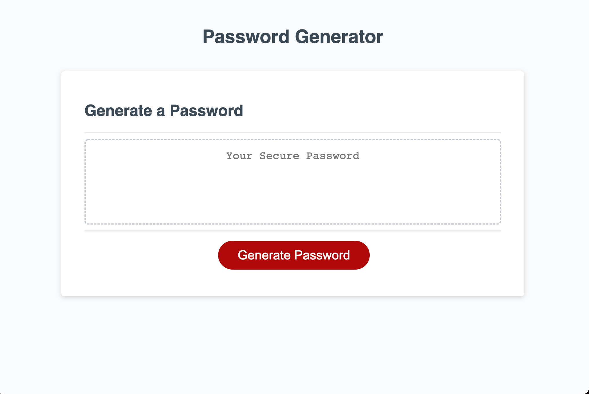
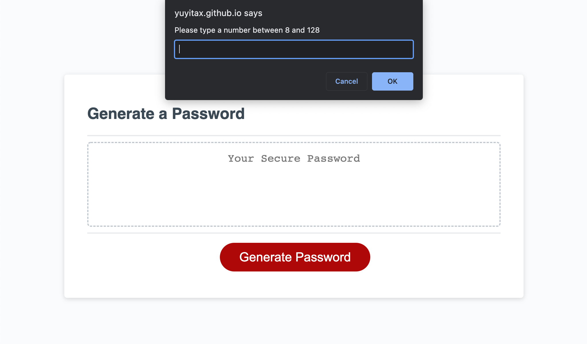
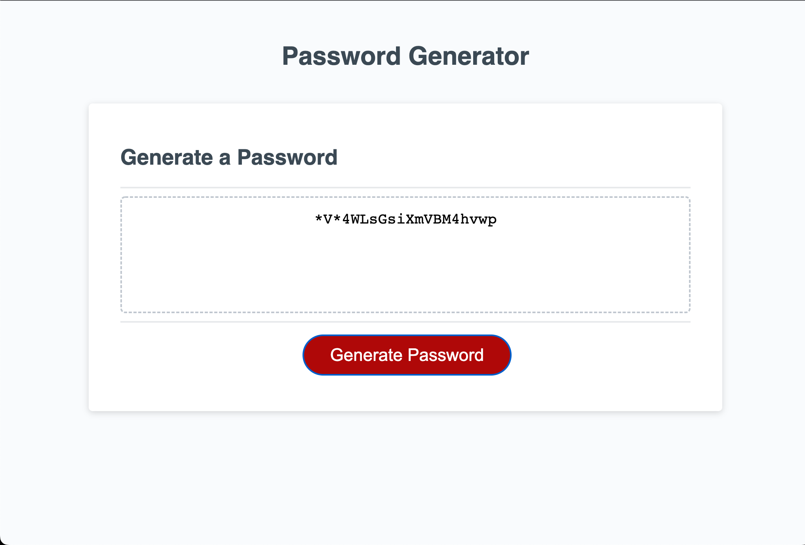

# The JavaScript Password Generator Challenge

## About the Project

In this project you will be able to appreciate an application that generates random passwords with a length between 8 and 128 characters. The password is personalized according to the user's criteria. 


Every detail of the functions and changes have a comment inside my code. Please refer to the scrip.js file in order to view these comments. [script.js](./assets/script.js)


## Acceptance Criteria for this project

```
GIVEN I need a new, secure password
WHEN I click the button to generate a password
THEN I am presented with a series of prompts for password criteria
WHEN prompted for password criteria
THEN I select which criteria to include in the password
WHEN prompted for the length of the password
THEN I choose a length of at least 8 characters and no more than 128 characters
WHEN asked for character types to include in the password
THEN I confirm whether or not to include lowercase, uppercase, numeric, and/or special characters
WHEN I answer each prompt
THEN my input should be validated and at least one character type should be selected
WHEN all prompts are answered
THEN a password is generated that matches the selected criteria
WHEN the password is generated
THEN the password is either displayed in an alert or written to the page
```

## Screenshots








**Please View the Final page here: [View my Password Generator](https://yuyitax.github.io/03-js-challenge/)

- - -
© 2022 Cristina Yunes. All Rights Reserved.
